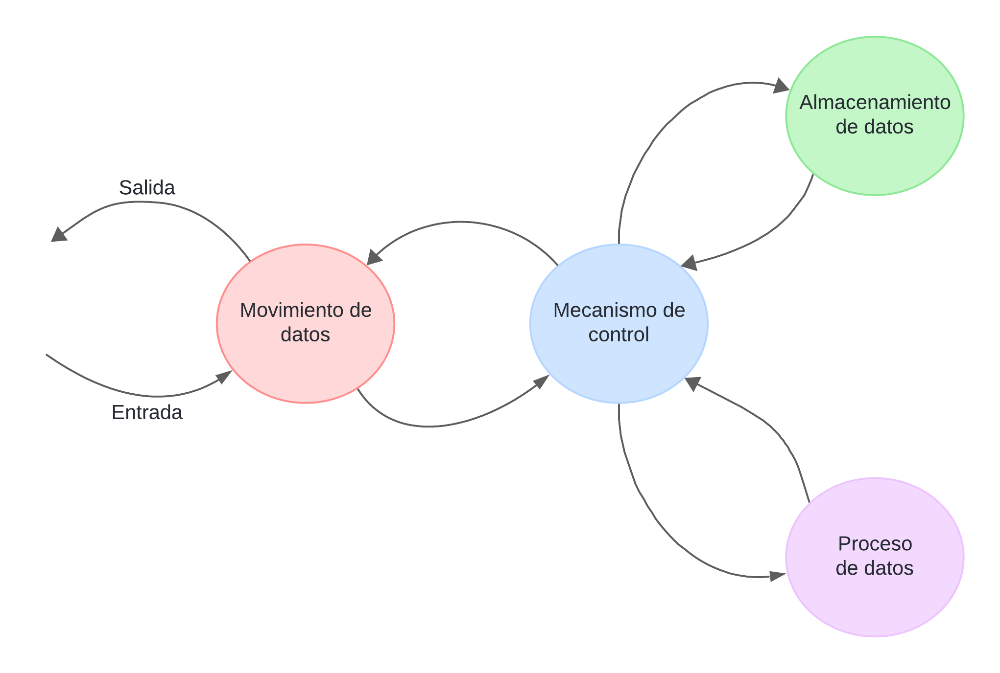
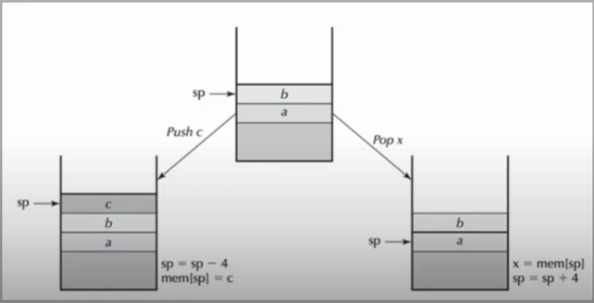
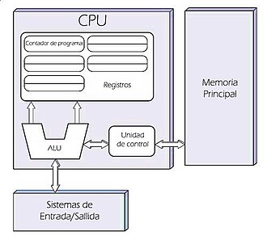

# *Informe de Investigación Sobre Arquitectura de Computadoras*

Electronica IV - TP - Arquitectura de Computadora

### ***Juarez, Gustavo Leonel***

## *Introducción*

En este informe se desea presentar las ideas mas importantes acerca de lo que es una computadora, como y cuales son sus arquitecturas, 
como evolucionaron a lo largo de los años, y además, de poder definir y conocer las diferencias entre los parametros que componen una 
computadora. Por ello ahora realizaremos una breve introduccion a los principaes temas que se abordaran en este informe.

> **¿Qué es una computadora?**

Como primer acercamiento podemos dar la siguiente definicion de computadora:

*"Una computadora es una máquina electrónica digital programable que ejecuta una serie de operaciones para procesar los datos de*
*entrada, obteniendo información que posteriormente se envía a la unidades salida."*

Algunas de las funciones mas sencillas que seria capaz de realizar son:
* Procesamiento de datos
* Almacenamiento de datos
* Movimiento de datos 
* Control

Entonces una computadora deberia ser capaz de procesar datos que ingresen o salgan de esta, ser capaz de almacenarlos para utilizarlos 
luego, poder transferir estos datos, es decir, moverlos entre las distintas partes que componen la maquina y poder mantener un control 
sobre los datos y el estado de los mismos.

De estos conceptos podemos tener una vista preliminar de como funcionaría una computadora:

> **¿Qué es la arquitectura de una computadora?**

Según Hennessy y patterson, la arquitectura de una computadora es la interface entre el softeware de bajo nivel y el hardware, indicando
que es la que posibilita implementaciones de diversos coste/rendimiento en la que corre el software principal. La arquitectura debe contener
todo lo que los programadores necesitan conocer para que el programa SW (lenguaje maquina) funcione correctamente. 

Asi al estudiar la estructura que tiene un computador podemos determinar las unidades operacionales que utilizará, como así tambien las
formas de relacionarlas para que implementen las especificaciones deseadas. Algunos de los atributos de la estructura son:
* Las señales de control.
* Interfaces entre el computador y los perifericos.
* La tecnologia de memoria utilizada.
* El tipo de operadores aritmeticos seleccionado.

## *Clases de arquitectura de computadora*

> Fundamentando con citas bibliográficas:
>
> - Explica brevemente los tipos de arquitectura de computadora que hayas encontrado en la bibliografía
> - Discute para cada tipo sus características distintivas, ventajas y desventajas
> - Considera *al menos* lo siguiente: máquina de pila, máquina de registros y máquina de acumulador; RISC y CISC; Von Newmann y Harvard
> - Sitúa en este contexto la arquitectura ARMv7M

Como ya se explico anteriormente la arquitectura de una computadora establece la organizacion de los distintos elementos fisicos que componen
a la computadora (o algun elemento de esta) y a su vez la relacion que estos tendrán con el software principal y sobre todo el lenguaje de la 
maquina. Por lo tanto, dependiendo del tipo de arquitectura que tenga la computadora, esta se diferenciara de otras en terminos de costo, 
rendimiento y de la forma en que sus partes se interralacionan.

Algunas de las arquitecturas mas conocidas en la actualidad son:
+ La maquina de Pila
+ La maquina de registros y de acumulador
+ RISC
+ CISC
+ La arquitectura Von Neumann
+ La arquitectura Harvard

### ***Maquina de pila***

Este tipo de arquitectura proviene de organizar los operandos que procesa el CPU en una pila, como su nombre lo indica. Esta organizacion consiste
en el algoritmo LIFO (Last In, First Out). La pila es un conjunto ordenado de tamaño variable desde elementos que accede solamente desde su cabecera
o Stacker Point (SP).

Trabaja basicamente con dos opciones implementadas con las sentencias PUSH (apilar un elemento) y POP (sacar un elemento). Las operaciones se realizan
con la SP o cabecera. Cabe recalcar que no es necesario definir una direccion en este tipo de arquitectura, ya que de manera implicita el operando o dato
esta en la cima de la pila.

En la siguiente imagen podemos ver un diagrama de la maquina de pilas:

Esta arquitectura permite un modelo sencillo para la evaluacion de los procesos realizados y consta además de instrucciones cortas las cuales pueden generar
una buena densidad de codigo. Pero este tipo de arquitectura no permite su acceso de manera aleatoria a los datos guardados, esta limitación no permite
lograr un codigo eficiente, tambien dificulta una implementacion de manera eficiente ya que la pila llega a ser un cuello de botella, ya que su forma de
operar puede llegar a ser demasiado lenta e ineficiente si se trabaja con una gran variedad de datos.

### ***Maquina de registros y de acumulador***
La arquitectura de acumulador es un tipo de registro que consiste en guardar los datos de la memoria en un lugar denominado acumulador, donde todos los
procesos que se realicen se diseñan para producirse directamente en este, además de ser el lugar donde luego se guardarán. La ubicacion de los datos es 
implicita pues el unico lugar donde se guardan es en el acumulador, por esta razon se considera util debido a su simplicidad y a su facil implementación.
Pero esta arquitectura en terminos de rendimiento es ineficiente, ya que tener todos los datos guardados en un solo lugar dificulta el procesamiento de
los mismos, puesto que el acumulador es un espacio de memoria temporal generando que el trafico de memoria sea el mas alto entre las aquitecturas.

Por ello para solucionar estos problemas se utilizo la maquina de registros de proposito general, esta arquitectura permitia una organizacion explicita 
de los datos ya que se almacenaba en direcciones de memoria a diferencia de las anteriores estructuras. Esta organizacion permitia una ordenación más
flexible que las pilas y los acumuladores a la hora de evaluar las expresiones debido a que utilizan variables para contener los datos. Cuando las variables
estan ubicadas en los registros se reduce el trafico de memoria, se acelera el programa y mejora la densidad de codigo. Una de sus principales desventajas 
es la complejidad que poseen en su realizacion, ya que su codigo o su forma de operar no es tan sencilla o directa como los anteriores.

### ***RISC y CISC***
Un conjunto de instrucciones es la especificacion de las intrucciones que la CPU puede entender y ejecutar, estas son los comandos basicos que la CPU utiliza
para llevar a cabo tareas especificas. Las intrucciones de este conjunto suelen ser operaciones basicas como sumar, restar, cargar datos, etc. 
Entre los conjuntos de intrucciones destacan principalmente dos:

* RISC (Reduced Instruction Set Computing)

Es un pequeño conjunto de instrucciones las cuales cada una se puede ejecutar en casi la misma cantidad de tiempo, normalmente en un ciclo de reloj. Consiste
en instrucciones sencillas y especificas permitiendo que la CPU puede trabajar de una manera eficiente y con un alto rendimiento, debido a su sencillez el 
codigo que especifican las intrucciones suele ser extenso, ya que se deben definir cada instruccion a realizar. Su uso suele estar asignado a microprocesadores
o microcontroladores que se ocupan de tareas simples y sencillas.

* CISC (Complex Instruction Set Computing)

Es un conjunto de instrucciones mas amplio y complejo que las RISC, por esta razon necesitan un mayor tiempo a la hora de su ejecución (mas de cinco ciclos de reloj),
son capaces de realizar multiples operaciones en una sola intruccion por lo que su codigo es mas compacto generando que su requerimiento de almacenamiento sea menor,
al tener un lenguaje mas complejo permite tener una mejor correspondencia a lenguajes de alto nivel logrando así facilitar la compilación de los programas, la corrección
de errores y modificación del codigo resultante.

### ***Arquitectura Von Neumann***

### ***Arquitectura Hardvard***

### ***ARMv7M***

La arquitectura ARMv7M es una arquitectura de procesador diseñada especialmente para aplicaciones de microcontraladores y sistemas embebidos de bajo costo, esta se caracteriza por su eficiciencia y bajo
consumo de energia, esto se debe a que utiliza una arquitectura RISC para procesar sus datos, combinando intrucciones de 16 y 32 bits para mejorar la eficiencia del codigo.
Esto hace que esta arquitectura sea una buena opcion cuando se busca un equilibrio entre rendimiento, eficiencia energética y flexibilidad en entornos embebidos, aun así 
se puede ver superada cuando se trata de aplicaciones que requieran un cómputo mas intensivo.

## Partes de una arquitectura de computadora

> Fundamentando con citas bibliográficas:
>
> - Explica las distintas partes de una arquitectura de computadora
> - Analiza a la luz de lo desarrollado la arquitectura ARMv7M

### Partes de una Arquitectura de Computadora:

Las partes que conforman la arquitectura de una computadora son:

+ **Unidad Central de Procesamiento (CPU)**:
   
La CPU es el núcleo de la computadora, responsable de ejecutar instrucciones y procesar datos. Según Tanenbaum y Bos, "La CPU de una computadora es la parte de la computadora que realiza la mayoría de los cálculos y controla el resto del sistema". (Tanenbaum & Bos, 2014).

+ **Memoria**:
   
La memoria almacena datos y programas que la CPU necesita para realizar sus operaciones. Según Hennessy y Patterson, "La memoria es una colección de celdas numeradas, cada una de las cuales contiene un byte de información y cada una tiene una dirección única". (Hennessy & Patterson, 2017).

+ **Unidad de Control (UC)**:
   
La UC coordina las operaciones de la CPU, interpretando y ejecutando instrucciones. Según Patterson y Hennessy, "La unidad de control (UC) secuencia las operaciones, decodifica las instrucciones y genera las señales de control necesarias para ejecutarlas". (Patterson & Hennessy, 2017).

+ **Unidad Aritmético-Lógica (ALU)**:
   
La ALU realiza operaciones aritméticas y lógicas en los datos. Según Stallings, "La unidad aritmético-lógica (ALU) realiza las operaciones aritméticas (como la suma y la resta) y las operaciones lógicas (como AND, OR y NOT)". (Stallings, 2019).

+ **Buses**:
Los buses son canales de comunicación que permiten la transferencia de datos entre los diferentes componentes del sistema. Según Hennessy y Patterson, "Los buses son conjuntos de cables o caminos de comunicación a través de los cuales se pueden transferir los datos". (Hennessy & Patterson, 2017).

+ **Dispositivos de Entrada/Salida (E/S)**:
   
Los dispositivos de E/S permiten la interacción entre la computadora y el usuario o el mundo exterior. Según Tanenbaum y Bos, "Los dispositivos de entrada y salida permiten que una computadora se comunique con el mundo exterior". (Tanenbaum & Bos, 2014).

### Análisis de la Arquitectura ARMv7M:

La arquitectura ARMv7M es una arquitectura de conjunto de instrucciones (ISA) diseñada para sistemas embebidos de bajo consumo energético y alta eficiencia en aplicaciones como microcontroladores. Incorpora características específicas para sistemas embebidos, como modos de bajo consumo y operaciones en tiempo real.
Comparado con las arquitecturas más tradicionales de propósito general, como x86, ARMv7M se destaca por su eficiencia energética y su arquitectura de baja potencia. Esto lo hace ideal para dispositivos portátiles y sistemas embebidos donde la duración de la batería y el rendimiento son críticos.
La arquitectura ARMv7M sigue los principios fundamentales de la arquitectura de von Neumann, con una CPU que ejecuta instrucciones almacenadas en memoria. Sin embargo, se adapta específicamente a las necesidades de los sistemas embebidos al ofrecer modos de bajo consumo y operaciones en tiempo real.
En resumen, la arquitectura ARMv7M es una evolución de las arquitecturas de computadoras tradicionales, adaptada para satisfacer las demandas de eficiencia energética y rendimiento en sistemas embebidos y dispositivos portátiles.

## Conclusiones

> En este capítulo debes exponer con tus palabras lo siguiente
>
> - ¿Qué es, para tí, una arquitectura de computadoras?
> - Si descomponemos un sistema de cómputo en capas ¿Qué posición ocupa la arquitectura?
> - ¿Cuál es la función que cumple una arquitectura de computadora?
> - ¿Qué considerarías a la hora de elegir una arquitectura de computadora?
>
> *Nota:* El contenido de este capítulo expone lo que aprendiste durante la investigación para desarrollar este práctico. Es un espacio para tu propia reflexión. Intenta exponer tus propias ideas, tal vez sea bueno hacerlo luego de apartarte unas horas del material de referencia para evitar seguir demasiado de cerca una fuente particular.

## Bibliografía

> Aquí listarás todas las fuentes bibliográficas citadas. Sigue para tus citas y referencias las [normas de la APA](https://normas-apa.org/citas/), usando *citas parrafraseadas* en el texto.
